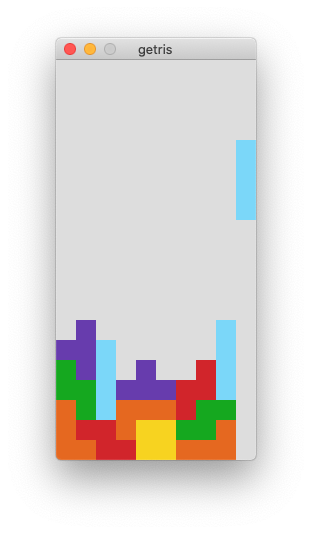

# getris

This is tetris written in Go.



# Usage

## Game start
```
$ make run
```

## Control

|Key|Action|
|---|---|
|←|Left|
|→|Right|
|↓|Drop|
|↑|Hard Drop|
|ｚ|Rotate left|
|ｘ|Rotate right|

# Requirement

- Golang
- [go-sdl2](https://github.com/veandco/go-sdl2)
